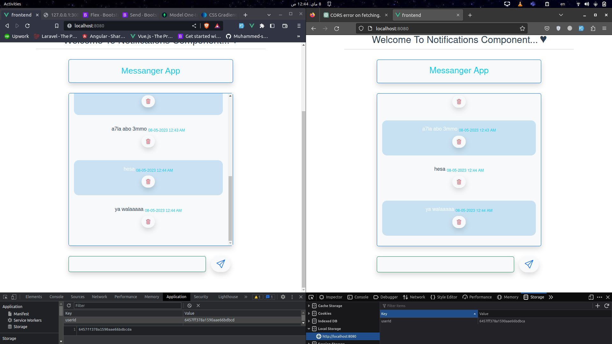

# ITI-Push-and-Pull

This is a simple chat app that allows users to make realtime chating.

## Features

- each user can send and recieve messages.
- the action can be noticed immediatly.

-----

## Installation

To install and run this project no your local machine, follow these steps:

1. Clone this repository
2. Move to backend directory then install it's dependancies using the following command:
    ```
    npm install
    ```
3. Then you can run the backend server using the following command:
    ```
    npm start
    ```
4. After that return to root directory of the project then move to frontend directory.

5. Install frontend dependancies using the following command:
    ```
    npm install
    ```
6. Start the frontend server using: 
    ```
    npm run serve
    ```

-----
## Navigate To our Great App

after running the 2 servers (front, back) you can easily follow the [Our Messanger App](http://127.0.0.1:3000/notifications) 'http://127.0.0.1:3000/notifications'.
 
This Welcome Page will be displayed for u:

| Welcome Page |
| ------------ |
|  |

-----
## License

This project is licensed under the `ITI` License.
made by <code style="color: cyan">[Muammed Saber](https://github.com/Muhammed-saber79)</code> 🙂.


